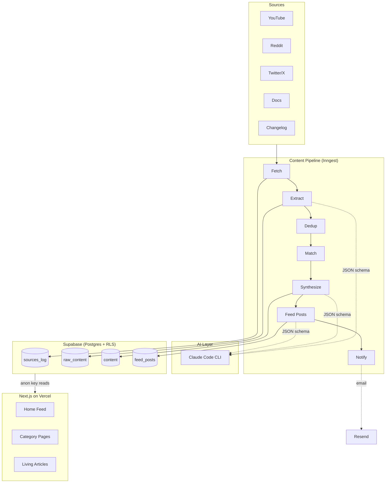

# TipStack

AI workflow tip aggregation platform. Fetches content from YouTube, Reddit, Twitter/X, news, and documentation sources, runs it through a Claude-powered extraction/dedup/synthesis pipeline, and publishes curated tips as living articles.

## Architecture



## Tech Stack

- **Framework:** Next.js 16 (App Router, React 19)
- **Styling:** Tailwind CSS v4, shadcn/ui, Framer Motion
- **Database:** Supabase (Postgres + RLS)
- **AI Pipeline:** Claude Code CLI with JSON schema enforcement
- **Orchestration:** Inngest (multi-step functions)
- **Email:** Resend (admin notifications)
- **Hosting:** Vercel

## Categories

Claude Code Features | Security & Guardrails | GitHub Skills | Prompting & Rules | Workflow Patterns | MCP & Integrations | Debugging & Testing

## Getting Started

```bash
cp .env.example .env.local   # fill in API keys
npm install
npm run dev                   # http://localhost:3000
```

## Content Pipeline

```
Fetch -> Extract -> Dedup -> Match -> Synthesize -> Feed Posts -> Notify
```

Run manually:

```bash
./scripts/run-pipeline.sh            # full pipeline
npx tsx scripts/fetch-all.ts         # fetch only
npx tsx scripts/process-fetched.ts   # extract only
npx tsx scripts/push-content.ts      # dedup + synthesize
npx tsx scripts/seed-feed-posts.ts   # generate feed posts
```

## Database Migrations

```bash
supabase db push    # apply pending migrations
```

Migrations live in `supabase/migrations/` (numbered sequentially).

## Environment Variables

See `.env.example` for the full list. Key groups: Supabase, Anthropic, YouTube, Reddit, Inngest, Resend, and revalidation secret.
